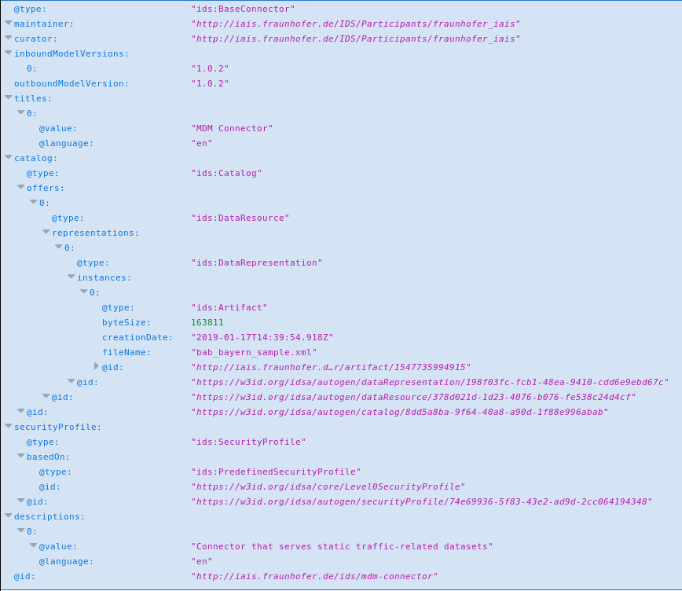
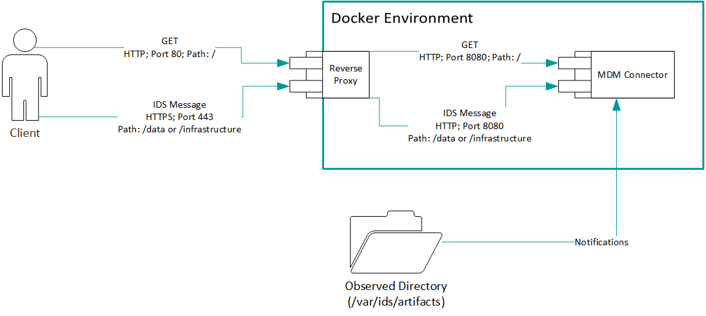

# Industrial Data Space Connector (Enterprise Integration Connector)

This is an implementation of an Industrial Data Space (IDS) Connector that serves static content (files) using the standard
message types defined in the IDS Information Model. 

## Functionality

The Connector listens to a file system changes in a directory of the local file system. Whenever files are placed in that
directory, they are considered "artifacts" (i.e., according to the IDS Information Model, static data dumps with a defined
content). The Connector assigns these artifacts an id (a URL) and a semantic description. Furthermore, they are added to the
Connector's self description so that they can be retrieved by consumer Connectors. 

## Building and Running

### Building Locally 
If you have the necessary developer tools (Maven, Java) installed on your machine, the Connector can be built like this:

Note: You require proper login Credentials for the DAPS Service. Put the required key and truststore under resources. Example: iais3-keystore.jks, iais3-truststore.jks


1. navigate to the project's root directory,
2. type ```mvn clean package``` (builds the Connector).

After that you can find an executable jar in the ```docker/mdm-connector``` directory. This jar may be exectued on it's own. 

### Docker - Based Building
However, in order to enable TLS (via reverse proxy), and additional features, we provide a ```docker-compose``` file to conveniently run both the Connector, the proxy and additonal apps by executing

* ```cd docker && docker-compose build && docker-compose up``` (builds the Docker images and runs the service(s)).

If you can't or don't want to build the Connector from source, just type

* ```cd docker && docker-compose up``` (which fetches the necessary images from a public repository).

The EI-Connector has currently following possible App-Integrations enabled by Default:
1. SFTP Inclusion - SFTP Tunneling to a shared folder for deploying and sharing artifacts in remote connectors
2. Semantic Instance Manger - GUI based creation and serilization of Information Model conform Objects and Messages

A documentation of these Apps can be found below.

### Usage

Once the Connector is started, it listens for changes in a configured directory (default is /var/ids/artifacts for the stand-alone connector and $local_dir/mdm-connector/docker/shared/artifacts). If files are placed
in this directory, they get added to the Connector's self description (retrievable by default at http://localhost:8080/). An exemplary
self description after a file has been added is depicted below:

 

Not that there exists an entry with the @id ```http://iais.fraunhofer.de/ids/mdm-connector/artifact/1547735994915```, which represents an artifact that
is hosted by the Connector. In order to retrieve this artifact, a consumer connector needs to send an ```ArtifactRequestMessage``` (as
defined in the IDS Information model) to the connector. As this implementation makes use of the HTTP protocol, the message is sent by
the client connector to the server connector (an instance of this implementation) as multipart document to ```http://localhost:8080/data```. 
This concept is defined and explained in more detail in the [IDS Handshake Document](https://industrialdataspace.jiveon.com/docs/DOC-1817).

The message's header part looks like this (no payload part is required):
```
{
  "@id" : "https://w3id.org/idsa/autogen/artifactRequestMessage/bbd669c5-7593-46e3-affb-c9ef0ad47a31",
  "@type" : "ids:ArtifactRequestMessage",  
  "modelVersion" : "1.0.2",
  "issued" : "2019-01-17T14:51:19.438Z",
  "issuerConnector" : "http://example.org/dummy",
  "requestedArtifact" : "http://iais.fraunhofer.de/ids/mdm-connector/artifact/1547735994915"
} 
```

As a result, the connector returns a multipart message of type ```ArtifactResponseMessage``` in the header and the artifact's content
in the payload part. The process is also documented in the form of an [acceptance test](src/test/java/de/fraunhofer/iais/eis/ids/ei-connector/acceptancetests/RetrieveArtifactTest.java). 

### Publish files through the MDM Connector

Publishing artifacts is easy. Simply copy them to the observed directory and they will be hosted. Optionally, you can also add ContractOffers (<file name>-contract.jsonld) and descriptions (<file name>-desc.(ttl|jsonld) in RDF according to the IDS Information Model. If no metadata files are supplied, default ones are used.

### First steps

#### Calling the Connector :
Use the bash scripts in the documentation directory to send your first messages to the connector endpoint. Please note that the ArtifactRequestMessage requires a correct Artifact URI. You can find one by checking the MDM Connector Self-Description at the root path.

#### Using the Connector to call other Connectors:


## Connector Architecture



A Reverse Proxy is used to handle all incoming messages. It provides two HTTPS secured endpoints (/data and /infrastructure) for regular IDS Messages and one plain HTTP (path: /) for the basic connector description in JSON-LD. For now, the connector will respond to a SelfdescriptionRequestMessage, an ArtifactRequestMessage and a ContractOffer-, ContractRequest- or ContractAgreementMessage as specified in the IDS Handshake Document, including a response with a RejectionMessage. Note that, even the IDS request fails, a HTTP 20* status code is returned but with an according IDS message. Support for more message types will may come in the future.


The MDM Connector code heavily relies on the IDS Components (IAIS Git, for access ask Sebastian Bader). Custom MessageHandler for any IDS Message can be added and registered in the AppConfig class. Properties, for instance URLs of IDS infrastructure components, are inserted in the applications.properties file.


## App Integrations
### SFTP
The SFTP Integration is based on a seperate Docker Container.
That Docker Container internally mounts the hosts volume ./docker/shared as the home repository
of the preconfigured user IDS. By binding keys from the hosts /mdm-connector/docker/sftp/user-keys to the container
internal /home/ids/.ssh/ the used Public Keys can be exchanged on Startup of the Connector. You can use and configure the SFTP connection as following:

USE
- For starting an SFTP Connection
    ```
    sftp -o IdentityFile=<PrivateKey> -P 2222 ids@<host>
    sftp -o IdentityFile=TestingKeysFraunhoferIAIS -P 2222 ids@eis-idsplus
    ```

CONFIGURE  
- For Changing the Public-Private Keys for logging in:
  Replace the PUBLIC key stored in 
  ```
  \sftp\user-keys\
  ```

- For Providing Server Certificates:
  Replace the files stored in
  ```
  \sftp\server-keys\
  ```
  
- Despite a Public-Private Key authentication also a standard login can be used. 
Althought not recommended change the COMMAND Line in the docker-compose.yml file.
    ```
    command: ids:<Password>:1002
    ```
    For disabling Password Login revert to  
    ```
    command: ids::1002
     ```
  
DEBUGGING:
- After SFTP login the user cannot PUT or GET files: The permissions of the hosts folder /shared/ are not sufficiently specified. You might require to give also non-owners (docker) read and write access


### Semantic Instance Manager

### Negotion Library

## Release notes
Releases conform to the major and Minor Information Model Versions. 


4.0.2 
- Open Source Publication
- Added Contract Handshake for Requested Artifacts

3.2.0. 
- Added SFTP integration
- Automatic generation of Example Contracts and Descriptions

3.0.0.
- Enables Information Model 3.0.0 
- Extracted Negotiation Library 

2.0.2. (unpublished)
- Has a functioning implementation of the Negotiation USE-Case
- Includes the google docker app by default


2.0.0. (unpublished)
- Version numbering changes from now on according to the respective Information Model used with sub-indexing of the actual number.
- Enables Information Model 2.0.0 
- Update to JAVA 11, Update Dependencies to new versions.


1.0.3   
- Attach more semantic information to the artifacts through descriptions
- Implement a generic method to provide additional metadata for the artifacts that the Connector serves

1.0.2   
- Register at a DAPS on startup
- Verify incoming security tokens
        
1.0.1   
- Detect artifacts automatically on startup
- Register at a Broker on startup


## Contributors (Fraunhofer IAIS)
* Dennis Kubitza (dennis.kubtiaz@iais.fraunhofer.de)
* Sebastian Bader (sebastian.bader@iais.fraunhofer.de)
* Christian Mader 
* Benedikt Imbusch
